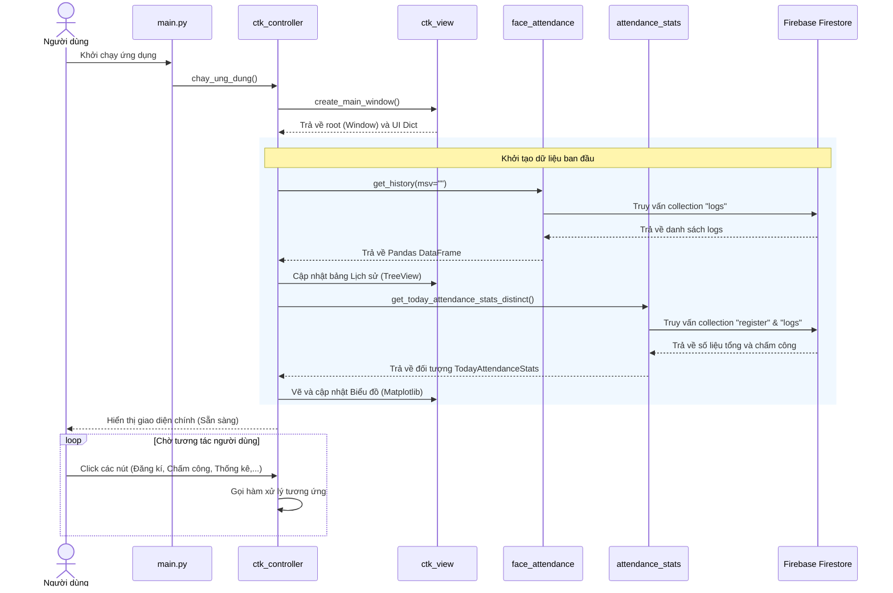
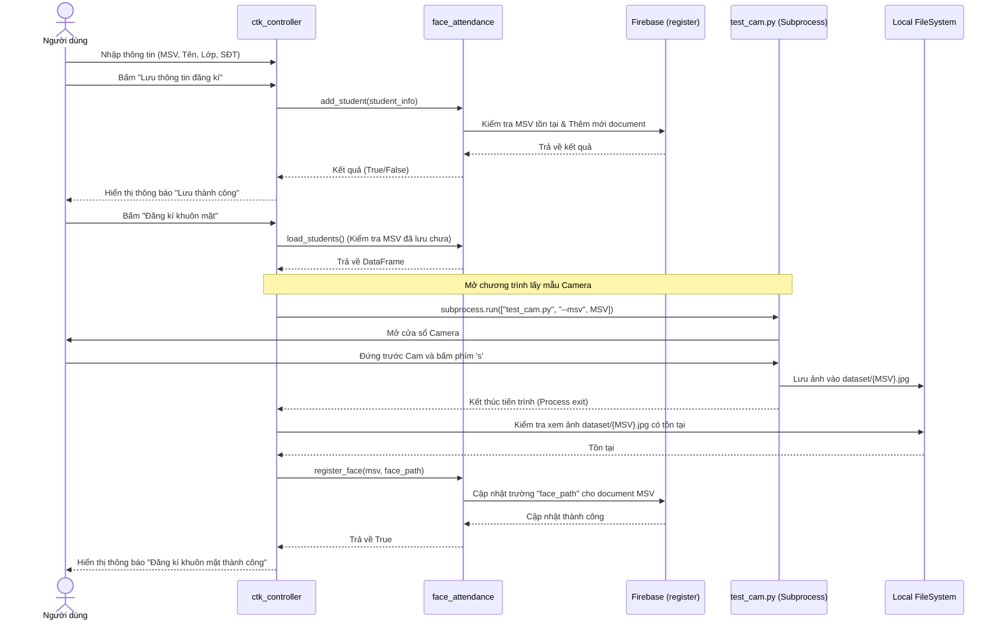
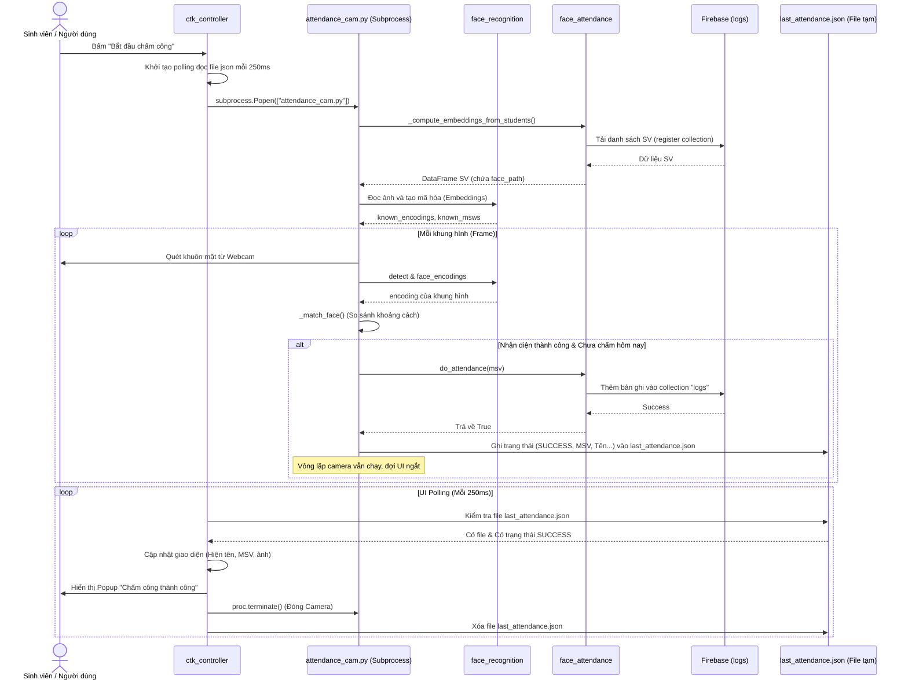
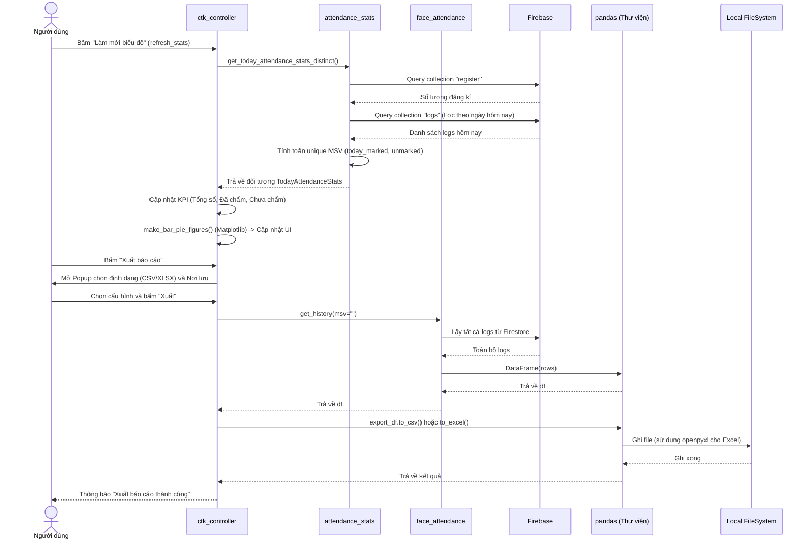
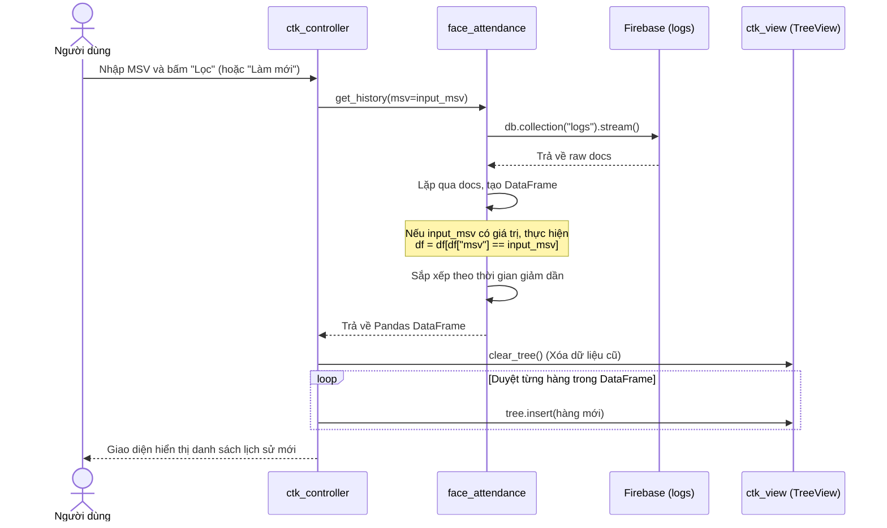

# Các Sơ Đồ Luồng Xử Lý (Sequence Diagrams)

Tài liệu này chứa các sơ đồ luồng xử lý (Sequence Diagrams) được vẽ bằng Mermaid cho ứng dụng điểm danh khuôn mặt SmartAttend.

## 1. Sơ đồ luồng xử lý tổng quan toàn hệ thống (Overall System Flow)

**Mô tả:** Sơ đồ này mô tả vòng đời chung của ứng dụng từ lúc người dùng khởi chạy cho đến khi tải dữ liệu khởi tạo và sẵn sàng nhận tương tác. Khi ứng dụng (`main.py`) được bật, hệ thống sẽ gọi Controller (`ctk_controller`) để vẽ giao diện. Trong quá trình khởi tạo UI, Controller sẽ âm thầm gọi hai luồng song song để truy xuất dữ liệu từ Firebase Firestore: một luồng tải lịch sử chấm công đổ vào bảng (TreeView), luồng còn lại tính toán KPI để vẽ hai biểu đồ Matplotlib. Sau khi mọi thứ sẵn sàng, vòng lặp chính của ứng dụng được mở ra để chờ phản hồi từ các nút bấm của người dùng.

## 2. Sơ đồ chức năng Đăng kí Sinh viên & Khuôn mặt

**Mô tả:** Quá trình đăng kí được chia làm 2 giai đoạn độc lập nhưng nối tiếp nhau. 
- **Giai đoạn 1 (Đăng ký thông tin):** Người dùng nhập thông tin text (MSV, Tên, Lớp, Số điện thoại) và lưu. Controller gọi `face_attendance.add_student()` để đẩy thẳng document này lên collection `register` của Firestore.
- **Giai đoạn 2 (Đăng ký khuôn mặt):** Người dùng ấn "Đăng ký khuôn mặt". Controller mở một tiến trình phụ (`test_cam.py`) để chạy camera độc lập nhằm tránh giật lag UI. Sinh viên đứng trước cam và bấm phím 's' để chụp. Ảnh lưu cục bộ ở thư mục `dataset/`. Khi camera tắt, tiến trình chính kiểm tra sự tồn tại của file ảnh và cập nhật lại đường dẫn file này lên Firestore cho tài khoản sinh viên đó.

## 3. Sơ đồ chức năng Chấm công (Attendance Flow)

**Mô tả:** Đây là quy trình phức tạp nhất. Khi ấn "Bắt đầu chấm công", luồng UI chính (Controller) không trực tiếp xử lý camera (tránh ứng dụng bị đơ), mà sinh ra một Subprocess chạy file `attendance_cam.py`. 
Để giao tiếp giữa tiến trình chính và tiến trình camera phụ, hệ thống dùng 1 file tạm là `last_attendance.json`.
- File Camera quét khuôn mặt, tính khoảng cách mã hóa (embeddings) để xác định danh tính. Nếu thành công và người dùng chưa điểm danh trong ngày, nó ghi dữ liệu lên collection `logs` của Firestore và đồng thời nhả trạng thái SUCCESS ra file JSON.
- Ở phía UI, Controller quét (polling) liên tục file JSON đó (250ms/lần). Nếu bắt được tín hiệu SUCCESS, UI sẽ load thông tin hiển thị lên màn hình, hiện popup thông báo thành công và trực tiếp tiêu diệt tiến trình Camera để kết thúc lượt chấm công, sau đó xóa file JSON dọn dẹp.

## 4. Sơ đồ chức năng Thống kê và Xuất báo cáo

**Mô tả:** Chức năng này phục vụ cho tab Thống Kê và Báo Cáo. 
- **Khi làm mới thống kê:** Module `attendance_stats` sẽ quét qua toàn bộ dữ liệu ở collection `register` để lấy tổng số sinh viên và đối chiếu với collection `logs` để đếm ra bao nhiêu người đã/chưa điểm danh trong ngày hôm nay. Dữ liệu này được chuyển đổi thành 2 biểu đồ Matplotlib tích hợp sẵn trong UI.
- **Khi xuất báo cáo:** Người dùng chọn định dạng Excel/CSV. Hệ thống truy vấn toàn bộ lịch sử `logs` từ Firestore về thông qua Pandas DataFrame. Cuối cùng, hàm `to_csv` hoặc `to_excel` của Pandas (cùng thư viện bổ trợ openpyxl) sẽ chuyển DataFrame thành file vật lý được lưu trữ ở ổ cứng cục bộ.

## 5. Sơ đồ chức năng Xem lịch sử (View History)

**Mô tả:** Thao tác xem lịch sử đơn giản và phản hồi nhanh. Khi người dùng muốn làm mới toàn bộ bảng hoặc cần tra cứu hành tung của một sinh viên cụ thể (Lọc theo MSV), UI sẽ gọi xuống `face_attendance`. File này request một `stream()` toàn bộ bản ghi log trên Firestore, sau đó biến đổi sang định dạng Pandas DataFrame để sắp xếp giảm dần theo thời gian. Cuối cùng UI xóa hết dòng cũ ở bảng TreeView và nạp DataFrame mới này vào để hiển thị.

