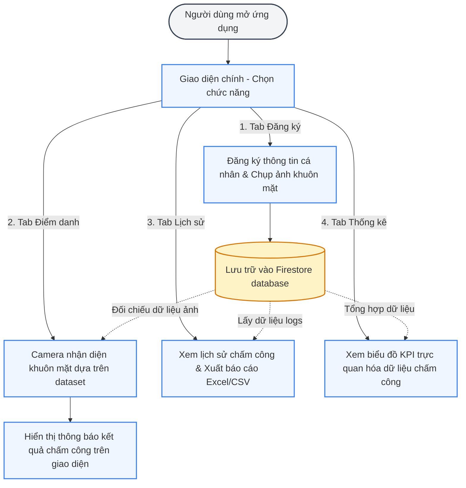
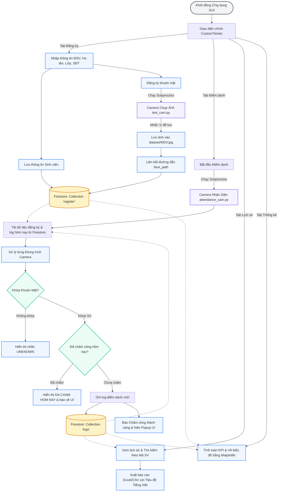
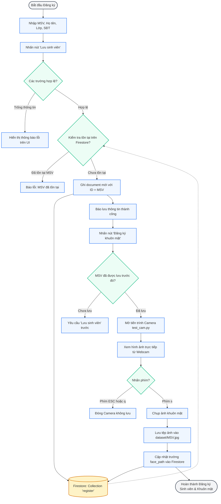
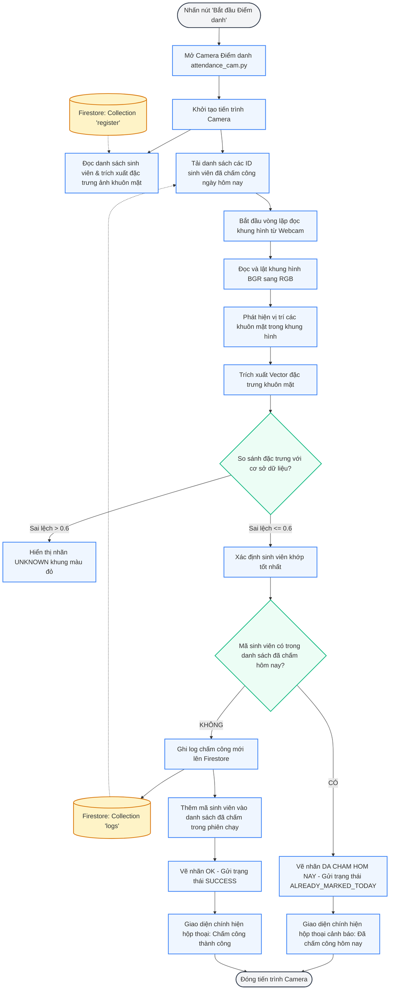
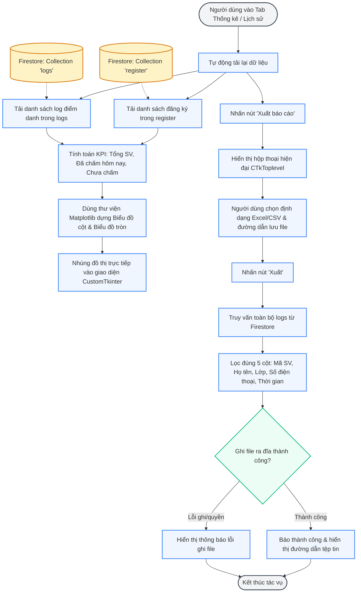

# SƠ ĐỒ LUỒNG HOẠT ĐỘNG HỆ THỐNG ĐIỂM DANH KHUÔN MẶT

Tài liệu này chứa các sơ đồ luồng hoạt động (Activity Flowcharts) chi tiết của toàn bộ hệ thống điểm danh bằng khuôn mặt tích hợp cơ sở dữ liệu Cloud Firestore. 

> [!TIP]
> Tất cả các sơ đồ dưới đây đã được cấu hình tăng kích thước chữ lên **18px** và **tự động in đậm (bold)**. Khi xuất ra file ảnh chèn vào Word, chữ sẽ hiển thị cực kỳ to, rõ ràng và dễ đọc ngay cả khi thu nhỏ biểu đồ.

---

## 1. SƠ ĐỒ LUỒNG TỔNG QUAN CƠ BẢN (High-Level Overview Flow) - KHUYÊN DÙNG ĐỂ KHỞI ĐẦU BÁO CÁO

Đây là sơ đồ mức độ cao (High-Level) mô tả tổng quát 4 nhánh tính năng chính của hệ thống một cách đơn giản, dễ hiểu theo đúng trải nghiệm của người dùng:

### Giải thích sơ đồ luồng tổng quan cơ bản:
*   **Bước khởi đầu:** Người dùng mở ứng dụng giao diện chính và lựa chọn 1 trong 4 tab chức năng.
*   **Nhánh Đăng ký:** Cho phép nhập thông tin cá nhân và liên kết ảnh khuôn mặt (chụp từ Webcam), toàn bộ dữ liệu này được đẩy trực tiếp lên Cloud Firestore để lưu giữ.
*   **Nhánh Điểm danh:** Hệ thống mở camera, trích xuất dữ liệu ảnh và so khớp với các mẫu đặc trưng khuôn mặt (dataset) đã lưu trên Firestore. Khi có kết quả, hệ thống hiển thị hộp thoại thông báo thành công hoặc cảnh báo trùng lặp.
*   **Nhánh Lịch sử:** Truy xuất danh sách log điểm danh từ database để hiển thị lên bảng tìm kiếm và cho phép kết xuất ra file Excel/CSV báo cáo.
*   **Nhánh Thống kê:** Tổng hợp dữ liệu chấm công thực tế để vẽ biểu đồ trực quan giúp quản lý theo dõi dễ dàng.

---

## 2. SƠ ĐỒ LUỒNG KIẾN TRÚC KỸ THUẬT HỆ THỐNG (Technical Architecture Flow)

Sơ đồ này mô tả chi tiết hơn về cách các tiến trình Python kết hợp với nhau cùng cơ sở dữ liệu:

---

## 3. Luồng chi tiết: Đăng ký Sinh viên & Khuôn mặt (Student & Face Registration)

Mô tả chi tiết luồng xử lý dữ liệu khi người dùng thêm thông tin sinh viên mới và chụp ảnh khuôn mặt:

---

## 4. Luồng chi tiết: Điểm danh bằng Nhận diện khuôn mặt (Face Attendance Check-in)

Mô tả logic nhận diện và đối chiếu với danh sách chấm công để chống trùng lặp trong ngày:

---

## 5. Luồng chi tiết: Thống kê & Xuất báo cáo (Stats & Export Report)

Mô tả cách ứng dụng hiển thị báo cáo trực quan dưới dạng đồ thị và xuất báo cáo:

